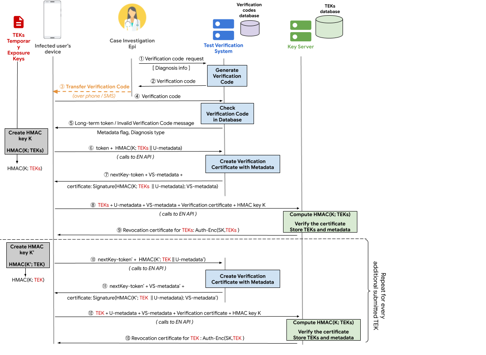

# Verification Server and Key Submission Process

The following describes endpoints and their function to ensure the NYS Covid Tracking system is compatible with the APHL Exposure Notification Verification and Key Servers defined in https://developers.google.com/android/exposure-notifications/verification-system. The NYS Covid Tracking system launch using NYS specific verification and key servers with the intent of migrating to the national APHL key server when ready. Ensuring that the NYS verification server, NYS key server, and NYS Mobile Exposure Notification App are compatible with the national verification and key servers will allow for a seamless transition.

The foollowing Verification Flow Diagram can be used to help indicate which part of the process each step below is referring to.

## Definitions

* __Case Investigation Epidemiologist (EPI)__: A Case Investigation Epidemiologist is a public health official who coontacts a user upon a positive diagnosis. They may also be referred to as Contact Tracers.
* __Verification Code (VC)__: A verification code is an 8 digit number generated by a public health official and given to a user. This is the code that allows app users to beging the process of submitting their TEKs to the key server.
* __Temporary Exposure Key (TEK)__: A key that's randomly generated once every 24 hours. It remains on the device for up to 14 days. In the event that there's a positive diagnosis of COVID-19, and upon permission granted from the user, these keys are provided to the app.
* __Verification Server Metadata (VS-metadata)__: Metadata about the user that was entered by an EPI and submitted when requesting a verification code. It can include things such as symptom onset date, test date, and transmission risk.
* __User Metadata (U-metadata)__: Metadata about the user that was entered by the user. It can include things such as symptoom onseet date and test date.
* __Public Health Authority (PHA)__: NYS Department of Health

## Requesting Verification Codes

Diagram Steps (1), (2), and (3).

Verification codes are requested by an EPI when a user has tested positive for Covid-19. The EPI (or an automated SMS text message) will transmit the VC to the user.

| | |
|:--- |:--- |
| Initiator | The EPI, using a PHA controlled website will send an HTTP request to the verification service. |
| Endpoint  | POST `/vc/generate` |
| Authn/Authz | Authorization Bearer JWT providing caller with ability to generate verification codes |
| Input | <pre lang="json">{   "onsetDate": "yyyy-mm-dd of symptom onset, optional",   "testDate": "yyyy-mm-dd of test, optional" }</pre> |

#### Description

The handler will verify the authorization header and ensure the JWT has ability to generate verification codes. It will generate a verification token 8 digits long. One of those digits should be a configurable check value. It will also generate an expiry timestamp (UTC). The VC, expiry timestamp, and metadata object will be written to the `verification_codes` table. If the VC already exists in the table then the generation process will be repeated until a non-used VC is found.

The `verification_codes` table has a primary key / unique index on the VC value.

#### Response

| Code | Data / Meaning |
| :---: | :--- |
| 200 | <pre lang="json">{   "code": "8 character verification code, likely all numbers",   "expiry": "UTC timestamp when this verification code will expire" }</pre> |
| 400 | Bad request, indicating the metadata is not valid |
| 401 | Caller is not authorized to use this endpoint (the JWT was rejected) |
| 500 | Server error |

__Open Question__: We should discuss whether the PHA will submit transmission risk overrides, or if we will use the App calculated transmission risks. If PHA provided, then they will be added to this input data object.

## Sending Verification Codes

Diagram Step (3) (alternative option)

The EPI can initiate a automated transfer of a VC to the user.

| | |
|:--- |:--- |
| Initiator | The EPI, using a PHA controlled website will send an HTTP request to the verification service. |
| Endpoint  | POST `/vc/send/sms` |
| Authn/Authz | Authorization Bearer JWT providing caller with ability to send verification codes |
| Input | <pre lang="json">{   "code": "8 digit verification code",   "mobile": "User's mobile phone #" }</pre> |

#### Description

The handler will verify the authorization header and ensure the JWT has ability to send verification codes. It will verify the mobile phone number is a valid phone number (though no country code checks should be done). If the mobile # doesn't include a country code then it will assume the US country code. It will verify the VC exists in table `verification_codes` and that it hasn't expired. It will then pass the input body to an AWS message queue. Messages on that message queue will initiate a Lambda that is capable of sending SMS messages. The SMS message should include an App deep link that will open the App, start the verification code submission process, and fill in the VC.

The system __NEVER__ stores the mobile number.

__Open Question__: To support people who don't want to give their mobile # should we also have an endpoint that can send an email?

## Submitting Verification Codes

## Request Signiture of TEKs and Metadata

## Submitting TEKs and Metadata
